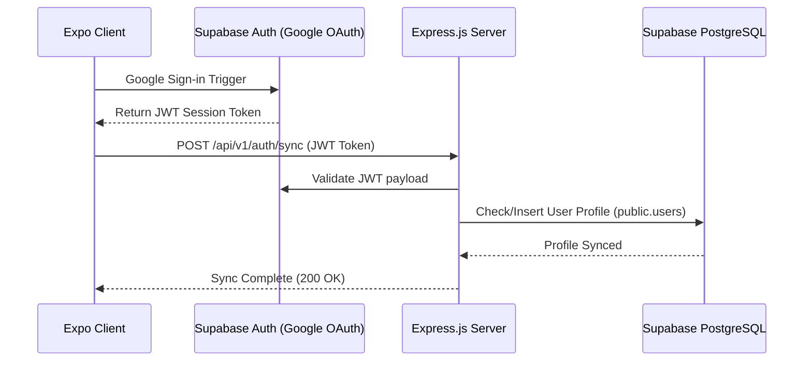

# Product Requirement Document (PRD): TripMate India

## 1. Document Control & Metadata

- **Product Name:** TripMate India
- **Version:** 1.2.0
- **Status:** Approved for Core Mobile Stack Development
- **Authors:** Development & Product Team
- **Target Audience:** Mobile Developers, Backend Developers, Product Designers, QA Engineers
- **Primary Platform:** Mobile (React Native / Expo for iOS & Android)

---

## 2. Product Vision & Value Proposition

### The Problem

Traveling across India is culturally rich but logistically challenging. Solo travelers, especially women, face security concerns. Additionally, travelers often pay inflated rates for cabs, accommodations, and guides when traveling alone, whereas group travelers split these costs. At the same time, local boutique tour guides, homestays, and adventure groups lack a dedicated channel to access ready-to-travel groups.

### The Solution

**TripMate India** acts as an aggregator and social network. It allows users to form travel squads ("Platoons") to:

1.  **Split Expenses:** Form groups to share taxi rides, homestay bookings, and guide fees.
2.  **Enhance Safety:** Solo travelers join verified groups, share live locations, and verify trip providers.
3.  **Unlock Exclusive Deals:** Group discounts from registered partner merchants (hotels, restaurants, rentals).

---

## 3. User Personas & Permissions

| Persona              | Description                                                | Core Goals                                                              | Access Permissions                                                                       |
| :------------------- | :--------------------------------------------------------- | :---------------------------------------------------------------------- | :--------------------------------------------------------------------------------------- |
| **Traveler**         | Individual looking to explore India safely on a budget.    | Find travel groups, split costs, book curated trips.                    | Can browse trips, join platoons, message groups, manage personal profile, write reviews. |
| **Trip Provider**    | Local guides, travel agency coordinators, trekking groups. | Publish group tour packages, recruit travelers, manage group logistics. | Can create/manage trips, view join requests, message trip platoons, verify itineraries.  |
| **Partner Merchant** | Homestays, hostels, rental companies, local eateries.      | Attract group bookings, offer coupon codes, increase volume.            | Can create promotional deals, track code redemptions, view booking statistics.           |
| **Admin**            | System operator.                                           | Maintain platform integrity, verify providers, resolve disputes.        | Global access, content moderation, verification verification.                            |

---

## 4. Key Functional Features & Flowcharts

### 4.1 Onboarding & Google OAuth Flow

- **Brand Presentation:** Swipable onboarding carousel showcasing _Form Platoons_, _Exclusive Deals_, and _Curated Trips_.
- **Google OAuth Sign-In:** Authenticates users natively through Supabase Auth.
- **Registration Sync:** Triggers a synchronization hook on our Express backend to create a public profile entry inside Supabase Postgres database.
- **Preferences Capture:** Checklist of travel styles: _Adventure/Trekking_, _Heritage/Culture_, _Leisure/Beach_, _Backpacker_, _Wellness/Yoga_. Used for feed personalization.



### 4.2 Trip & Expedition Explorer

- **Categorized List:** Tabs separating _Featured_, _Adventure_, _Heritage_, _Beach_, _Budget_. Powered by `Shopify Flash-List` for 60FPS scroll efficiency.
- **Trip Card Parameters:**
  - Trip Image (Supabase Storage or direct URL)
  - Title (e.g., "Leh-Ladakh Scenic Bike Run")
  - Location tag ("Leh, Jammu & Kashmir")
  - Price with Rupees symbol ("₹28,000 per head")
  - Timeline ("7 Days, 6 Nights")
  - Slots meter (e.g., "4/10 joined" indicator, glowing red when only 1-2 slots remain)
- **Detail Panel:**
  - Collapsible Day-by-Day Accordion (Itinerary using Postgres `JSONB` structure)
  - Host Bio & Verification Badge
  - Inclusions (Accommodations, bikes, breakfasts) & Exclusions (Lunches, airfare)
  - Reviews list

### 4.3 Platoon (Group) System — _Core Logic_

- **Joining Platoons:**
  - For **Curated Trips**: Clicking "Join" requests a slot. Upon payment, the user UUID is added to the Platoon members list.
  - For **Unplanned Trips**: Any traveler can set up a "Custom Platoon" (e.g., "Hampi weekend carpool"). Other travelers can request to join. The Platoon Leader must approve the request.
- **Stripe Payment Gateway integration:**
  - **Payment Sheets:** Paid trips launch the Stripe SDK Native Payment Sheet (`@stripe/stripe-react-native`) on mobile.
  - **Secure Intents:** The client fetches a `paymentIntent` from the Express backend, which generates the client secret using the secret Stripe API key.
  - **Webhooks Listener:** When a transaction succeeds, Stripe fires a webhook to `POST /api/v1/payments/webhook` on our Express server. The server verifies the signature and adds the traveler UUID to the target Platoon members list in Supabase Postgres.
- **Status Lifecycle:**
  1.  `Planning`: Recruiting members. Chat is active.
  2.  `Confirmed`: Minimum slots reached. Deposits paid (if applicable).
  3.  `Active`: Trip is currently ongoing.
  4.  `Completed`: Trip finished. Chat becomes read-only; review forms are sent to members.

### 4.4 Dashboard & Travel Analytics

- **Metric Grid:** Displays _Total Journeys_, _Active Platoons_, _Savings Accumulated (₹)_, and _Completed Trips_.
- **Visual Charts:** Uses SVG-based visual graphs depicting:
  - Travel frequency (monthly bar charts calculated via Postgres aggregates).
  - Category breakdown (radar or pie chart of travel styles).

---

## 5. Technical Architecture & Folder Structure

### 5.1 Frontend (Mobile App - Expo v56)

We maintain a file-based routing architecture. Views utilize NativeWind utility classes with colors and spacing mapped directly to a theme provider.

```
tripmate/
├── assets/                     # Graphic resources and icons
├── app/                        # Expo Router Pages
│   ├── (auth)/                 # Auth Screens (onboarding, login, register, verify-otp)
│   ├── (tabs)/                 # Bottom Bar screens (home, dashboard, platoons, profile)
│   ├── _layout.tsx             # Theme & Redux providers configuration
│   └── index.tsx               # Redirect entry point
├── components/                 # Presentation and container components
│   ├── AnalyticsChartCard.tsx  # Dashboard charts
│   ├── BottomNavBar.tsx        # Spring-animated bottom tab bar
│   ├── FeaturedTripCard.tsx    # Horizontal swipe cards
│   ├── MetricCard.tsx          # Dashboard 2x2 grid widgets
│   ├── OrganicHeader.tsx       # Search bar and user status
│   └── TripCard.tsx            # Vertical listing layout
├── utils/                      # Helper libraries
│   ├── colors.ts               # Color processors
│   ├── navigation.ts           # Type-safe routes
│   └── theme.tsx               # Material 3 Style Configs
```

### 5.2 State Management (Redux Store Architecture)

We plan to use **Redux Toolkit** for structured client-side state. The store is structured as follows:

```
src/redux/
├── store.ts                    # ConfigureStore combining slices & middleware
├── slices/
│   ├── authSlice.ts            # User session, JWT tokens, profile validation states
│   ├── tripSlice.ts            # Loaded trip packages, filters, search queries
│   └── platoonSlice.ts         # Active platoon participants, messages, and chat lists
```

---

## 6. Detailed API Endpoint Specifications

The backend exposes a REST API via `/api/v1` routes:

### 6.1 Authentication Endpoints

- **Google OAuth Profile Sync:**
  - `POST /api/v1/auth/sync`
    - **Payload:** `{ "accessToken": "SUPABASE_JWT_TOKEN" }`
    - **Response:** `{ "status": "success", "user": { "id": "uuid-1234", "name": "Raj", "email": "raj@example.com" } }`
- **Email OTP Authentication (Mailing Server Flow):**
  - `POST /api/v1/auth/otp/request`
    - **Payload:** `{ "email": "traveler@example.com" }`
    - **Action:** Server creates a 6-digit cryptographic PIN, sets a 5-minute expiration timestamp inside the `public.otps` database table, and dispatches an HTML email containing the verification code using `nodemailer` and SMTP credentials (e.g. Resend/SendGrid/SES).
    - **Response (200):** `{ "status": "success", "message": "OTP code dispatched to email." }`
  - `POST /api/v1/auth/otp/verify`
    - **Payload:** `{ "email": "traveler@example.com", "code": "184920" }`
    - **Action:** Validates the pin expiration and values in `public.otps`. Deletes used pins, creates or retrieves the profile inside `public.users`, and responds with the session JWT.
    - **Response (200):** `{ "token": "JWT_KEY", "user": { "id": "uuid-1234", "name": "Traveler Name", "email": "traveler@example.com" } }`

### 6.2 Trip Management Endpoints

- `GET /api/v1/trips?search=Leh&category=Adventure`
  - **Response:** Array of Trip Objects matching search criteria from public.trips.
- `POST /api/v1/trips` (Provider Authorization Required)
  - **Payload:** Full trip details (title, price, itinerary array, slot capacity, category).
  - **Response:** Created Trip Object.

### 6.3 Platoon & Messaging Endpoints

- `GET /api/v1/platoons/:id`
  - **Response:** Platoon Details (trip, leader, participant UUID array, status).
- `POST /api/v1/platoons/:id/join` (Traveler Authorization Required)
  - **Response:** Join request status (`pending`, `approved`, or `payment_required`).
- `GET /api/v1/platoons/:id/messages`
  - **Response:** Historic chat messages list from public.messages.

---

## 7. Socket.io Event Conventions (Real-Time Communication)

For chat functionality within Platoons, Socket.io is utilized over WebSockets:

- **Connection Setup:** Connect with headers containing `Authorization: Bearer <Supabase_JWT>`.
- **Client Events:**
  - `join_platoon`: Payload `{ "platoonId": "PL_123" }`
  - `send_message`: Payload `{ "platoonId": "PL_123", "text": "What time are we meeting in Jaipur?" }`
  - `typing_indicator`: Payload `{ "platoonId": "PL_123", "isTyping": true }`
- **Server Events:**
  - `message_received`: Emitted to all participants in `PL_123` containing `{ "id": "msg_99", "sender": "Raj", "text": "...", "timestamp": "..." }`
  - `user_typing`: Broadcasts typing state to other members.

---

## 8. Data Validation & Database Schema Rules (Supabase / Postgres)

### 8.1 User Schema Constraints

- `id`: Must reference Supabase `auth.users.id`.
- `email`: Must be unique and verified.
- `role`: Strict check constraints: `['traveler', 'provider', 'partner', 'admin']`. Defaults to `traveler`.

### 8.2 Trip Schema Constraints

- `price`: Minimum `0`. Must be stored as integer values in Indian Rupees (INR).
- `slots_left`: Can never exceed `slots_total` or drop below `0`. If `slots_left == 0`, status changes to "Fully Booked".

### 8.3 Platoon Schema Constraints

- `status`: Strict check constraints: `['planning', 'confirmed', 'active', 'completed']`.
- `members`: Array of UUIDs. Minimum `1` (the platoon leader). Maximum constraints depend on `slots_total` in the parent trip package.

---

## 9. Non-Functional & Performance Requirements

### 9.1 Performance & Fluidity (60 FPS Goal)

- **List Rendering:** Standard `<ScrollView>` is avoided for large lists. All trip feeds must implement `@shopify/flash-list`.
- **Animation Threads:** Any gestures or layout shifts (such as the curved header collapse or the bottom navigation bar capsule transitions) must be handled by the native UI thread using `useAnimatedStyle` from `react-native-reanimated`.
- **Image Optimization:** Trip images must utilize optimized dimensions with scale-to-fit caching configurations (`expo-image` or equivalent image cache).

### 9.2 Offline Resilience

- **Offline Cached View:** Users can view loaded trips, active platoon chats, and metrics without a network connection.
- **Redux Persist:** `Redux Persist` (backed by Expo's SQLite or `AsyncStorage`) caches trip models and dashboards locally.
- **Queueing Submissions:** Offline message inputs inside platoon chats queue locally and dispatch automatically upon network reconnection.

### 9.3 Security

- **API Verification:** Custom backend middleware validates Supabase session JWT signatures on headers.
- **Environment Safety:** All secrets, payment credentials, and back-end IPs must reside in `.env` and loaded using `expo-constants` (never hardcoded in bundle files).

---

## 10. QA Verification & Testing Cases

| Test Case ID   | Feature Area  | Description                                                         | Expected Outcome                                                                                   |
| :------------- | :------------ | :------------------------------------------------------------------ | :------------------------------------------------------------------------------------------------- |
| **TC_AUTH_01** | Google OAuth  | Trigger Google Auth through client.                                 | Redirects back with a valid Session token; triggers profiles sync request.                         |
| **TC_AUTH_02** | Profiles Sync | Sync profile with Express when UUID already exists in public.users. | Express responds `200 OK` and skips insertion to avoid duplications.                               |
| **TC_TRIP_01** | Trip Hub      | Search input typed: "Leh".                                          | List filters instantly matching text or tags.                                                      |
| **TC_PLAT_01** | Platoons      | Unplanned platoon join limit exceeded.                              | Join request CTA turns into "Fully Booked" disable state.                                          |
| **TC_CHAT_01** | Platoon Chat  | Message sent offline.                                               | Message displays with "sending/clock" icon; automatically resolves to checkmark upon reconnection. |

---

## 11. Future Integration Roadmap

- **AMP Service & Navigation Integrations (Future Updates):**
  - **Map Services (Google Maps / Mapbox APIs):** Integrate interactive maps to display trip routes, starting locations, active platoon carpool meeting points, and live traveler location tracking for safety.
  - **Amplitude Analytics (AMP):** Integrate event-tracking analytics to measure onboarding completion rates, user retention, platoon creation volumes, and partner discount clicks.
