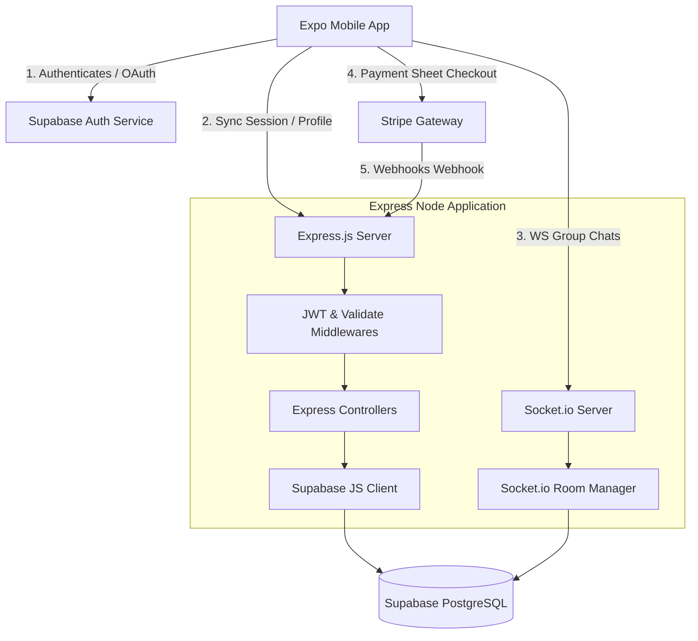
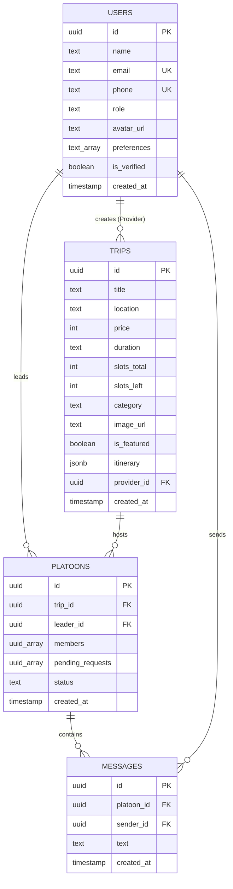

# Technical & System Architecture Document: TripMate India

This document describes the high-level system design, frontend and backend structures, database relationships, data synchronization patterns, and security models for TripMate India.

---

## 1. High-Level System Architecture

TripMate India is built on a distributed hybrid architecture:
*   **Client Side:** Expo/React Native mobile application compiled for iOS and Android.
*   **API Gateway & Custom Services:** Custom Express.js Node server handling security validations, business rules, Stripe transactions, and Socket.io WebSocket connections.
*   **Cloud BaaS Platform:** Supabase handles PostgreSQL storage, user authentication (including Google OAuth), and file storage buckets.
*   **Payment Gateway:** Stripe handles transactions.

### 1.1 Global Data Flow Diagram



---

## 2. Frontend Architecture (React Native / Expo)

### 2.1 State Management Flow (Redux Toolkit)
Client state is managed using **Redux Toolkit** and cached locally via **Redux Persist** backed by mobile `AsyncStorage`.

```
   [User Action UI] 
          │
          ▼
   [Dispatch AsyncThunk] ──(Axios HTTPS)──► [Express API Server]
          │                                         │
          ▼                                         ▼
   [State Reducer Hooks]                    [Postgres Update]
          │
          ├────────────────► [Local Store Cache Update]
          │
          ▼
   [Redux Persist File] ──► [Mobile AsyncStorage (Offline)]
```

*   **Auth Slice (`authSlice.ts`):** Holds user UUID, profile meta (roles, preferences), Google token details, and internet connection states.
*   **Trip Slice (`tripSlice.ts`):** Stores loaded trip arrays, categories state, and search cache keys.
*   **Platoon Slice (`platoonSlice.ts`):** Manages active squads list, chat logs array, and pending approvals queue.

### 2.2 Styling & Render Engine
*   **NativeWind v4:** Pre-compiles Tailwind CSS utilities into React Native stylesheets. Injects styling tokens from `utils/theme.tsx` dynamically to support light and dark mode switches.
*   **Moti & Reanimated:** Runs animations on the UI thread using Reanimated Worklets, preventing JavaScript thread congestion. Used for tab capsule expansion transitions in the bottom bar and curves expansions in header layouts.

### 2.3 Stripe Native Integration on Client
Mobile client integrates with `@stripe/stripe-react-native`.

1.  **Stripe Provider Setup:** Wrap the root layout in `<StripeProvider publishableKey={process.env.EXPO_PUBLIC_STRIPE_PUBLISHABLE_KEY}>`.
2.  **Payment Sheet Initialization:**
```typescript
import { useStripe } from '@stripe/stripe-react-native';

const { initPaymentSheet, presentPaymentSheet } = useStripe();

const initializePayment = async (tripId: string, platoonId: string) => {
  // 1. Fetch secrets from Express backend
  const { data } = await axios.post('/api/v1/payments/create-intent', { tripId, platoonId });
  
  // 2. Initialize Payment Sheet natively
  const { error } = await initPaymentSheet({
    merchantDisplayName: "TripMate India",
    customerId: data.customerId,
    customerEphemeralKeySecret: data.ephemeralKey,
    paymentIntentClientSecret: data.clientSecret,
    defaultBillingDetails: { name: 'Traveler Name' }
  });
  
  if (!error) {
    // 3. Display the sheet
    const { error: paymentError } = await presentPaymentSheet();
    if (paymentError) console.log("Payment canceled / failed");
    else console.log("Payment completed locally, awaiting webhook confirmation");
  }
};
```

---

## 3. Backend Architecture (Express & Supabase Integration)

The custom Express.js backend acts as a security wrapper around Supabase, preventing direct client manipulation of raw database tables.

### 3.1 Server Entry Point (`server.js`)
Configures the HTTP server, middleware pipelines, and initializes socket listeners:
```javascript
const express = require('express');
const http = require('http');
const cors = require('cors');
const helmet = require('helmet');
const { Server } = require('socket.io');

const app = express();
const server = http.createServer(app);

// Global Middlewares
app.use(helmet());
app.use(cors());

// Raw parser required ONLY for Stripe Webhooks to verify signatures
app.use('/api/v1/payments/webhook', express.raw({ type: 'application/json' }));
app.use(express.json());

// Load Routers
app.use('/api/v1/auth', require('./routes/auth'));
app.use('/api/v1/trips', require('./routes/trips'));
app.use('/api/v1/platoons', require('./routes/platoons'));
app.use('/api/v1/payments', require('./routes/payments'));

// Error Catcher Middleware
app.use(require('./middleware/error'));

// Setup Sockets
const io = new Server(server, { cors: { origin: '*' } });
require('./server/sockets')(io);

const PORT = process.env.PORT || 5000;
server.listen(PORT, () => console.log(`Server running on port ${PORT}`));
```

### 3.2 JWT Authentication Middleware (`middleware/auth.js`)
Validates Supabase-issued Google JWT sessions on private Express routes:
```javascript
const jwt = require('jsonwebtoken');

module.exports = (req, res, next) => {
  const token = req.header('Authorization')?.replace('Bearer ', '');
  
  if (!token) {
    return res.status(401).json({ error: 'Authorization header missing' });
  }

  try {
    // Verify using Supabase Auth JWT Secret
    const decoded = jwt.verify(token, process.env.SUPABASE_JWT_SECRET);
    
    // Decoded payload contains Supabase auth fields (sub = user UUID)
    req.user = {
      id: decoded.sub,
      email: decoded.email,
      role: decoded.user_metadata?.role || 'traveler'
    };
    
    next();
  } catch (err) {
    res.status(401).json({ error: 'Invalid token / Session expired' });
  }
};
```

### 3.3 Email SMTP Mailer Server Configuration (`utils/mailer.js`)
Configures Nodemailer with custom SMTP settings (Resend, SendGrid, SES, etc.) to email OTP codes:
```javascript
const nodemailer = require('nodemailer');

const transporter = nodemailer.createTransport({
  host: process.env.SMTP_HOST,
  port: parseInt(process.env.SMTP_PORT || '587', 10),
  secure: process.env.SMTP_SECURE === 'true', // true for 465, false for other ports
  auth: {
    user: process.env.SMTP_USER,
    pass: process.env.SMTP_PASS
  }
});

exports.sendOtpEmail = async (toEmail, otpCode) => {
  const mailOptions = {
    from: `"TripMate India" <${process.env.SMTP_SENDER_EMAIL || 'no-reply@tripmate.in'}>`,
    to: toEmail,
    subject: 'Verification Code - TripMate India',
    html: `
      <div style="font-family: Arial, sans-serif; padding: 24px; background-color: #f4f6f9; color: #121214; max-width: 500px; margin: 0 auto; border-radius: 12px; border: 1px solid #dce2e7;">
        <h2 style="color: #1a73e8; font-family: Montserrat, sans-serif; margin-bottom: 8px;">TripMate India</h2>
        <p style="font-size: 15px; line-height: 22px; color: #5e6573;">Enter this verification code in the app to complete authentication:</p>
        <div style="font-size: 32px; font-weight: bold; background-color: #ffffff; padding: 16px; border-radius: 8px; text-align: center; border: 1px solid #dce2e7; margin: 24px 0; color: #1a73e8; letter-spacing: 4px;">
          ${otpCode}
        </div>
        <p style="font-size: 12px; line-height: 18px; color: #8c93a3;">This code is single-use and will expire in 5 minutes. If you did not request this, please disregard this message.</p>
      </div>
    `
  };

  return transporter.sendMail(mailOptions);
};
```

---

## 4. Database Architecture & ERD (Entity-Relationship Diagram)

The database is built on **Supabase PostgreSQL**. Relational keys, index profiles, and check constraints enforce data integrity.

### 4.1 ERD Relationships Diagram



### 4.2 Query Optimization Indexes
*   `idx_trips_location_category`: Combined index on `(location, category)` for home search performance.
*   `idx_messages_platoon_time`: Compound index on `(platoon_id, created_at DESC)` to load chat history efficiently.
*   `idx_platoons_trip_id`: Indexes foreign key `trip_id` for quick joins.

---

## 5. Stripe Transaction Integration Model

### 5.1 Express Intent Creator (`controllers/paymentController.js`)
```javascript
const stripe = require('stripe')(process.env.STRIPE_SECRET_KEY);
const supabase = require('../config/supabase');

exports.createPaymentIntent = async (req, res, next) => {
  try {
    const { tripId, platoonId } = req.body;
    const userId = req.user.id; // From Auth Middleware

    // Fetch trip details from Supabase Postgres
    const { data: trip, error } = await supabase
      .from('trips')
      .select('price, title')
      .eq('id', tripId)
      .single();

    if (error || !trip) return res.status(404).json({ error: 'Trip not found' });

    // Create a customer or look up existing Stripe customer ID for user
    const customer = await stripe.customers.create({ metadata: { userId } });

    // Create Ephemeral Key for Payment Sheet
    const ephemeralKey = await stripe.ephemeralKeys.create(
      { customer: customer.id },
      { apiVersion: '2023-10-16' }
    );

    // Create Payment Intent
    const paymentIntent = await stripe.paymentIntents.create({
      amount: trip.price * 100, // Convert to Paise for INR
      currency: 'inr',
      customer: customer.id,
      metadata: { platoonId, userId, tripId },
      automatic_payment_methods: { enabled: true }
    });

    res.status(200).json({
      clientSecret: paymentIntent.client_secret,
      ephemeralKey: ephemeralKey.secret,
      customerId: customer.id
    });
  } catch (err) {
    next(err);
  }
};
```

### 5.2 Stripe Webhook Event Processor
```javascript
exports.handleWebhook = async (req, res, next) => {
  const sig = req.headers['stripe-signature'];
  let event;

  try {
    event = stripe.webhooks.constructEvent(
      req.body, // Must be parsed as RAW body
      sig,
      process.env.STRIPE_WEBHOOK_SECRET
    );
  } catch (err) {
    return res.status(400).send(`Webhook Error: ${err.message}`);
  }

  // Handle payment_intent.succeeded
  if (event.type === 'payment_intent.succeeded') {
    const paymentIntent = event.data.object;
    const { platoonId, userId } = paymentIntent.metadata;

    // Append user to Platoon members list in Supabase
    const { data, error } = await supabase.rpc('add_platoon_member', {
      platoon_uuid: platoonId,
      user_uuid: userId
    });

    if (error) console.error("Database update error:", error);
  }

  res.json({ received: true });
};
```

---

## 6. Real-Time Chat Architecture (Socket.io Rooms)

Socket.io runs inside the Express server, utilizing the HTTP port.

### 6.1 Server Sockets Module (`server/sockets.js`)
Validates connections and configures real-time chat event emitters:
```javascript
const jwt = require('jsonwebtoken');
const supabase = require('../config/supabase');

module.exports = (io) => {
  // Authentication middleware inside Socket.io
  io.use((socket, next) => {
    const token = socket.handshake.headers['authorization']?.replace('Bearer ', '');
    if (!token) return next(new Error('Authentication error'));

    try {
      const decoded = jwt.verify(token, process.env.SUPABASE_JWT_SECRET);
      socket.user = { id: decoded.sub };
      next();
    } catch (err) {
      next(new Error('Invalid socket credentials'));
    }
  });

  io.on('connection', (socket) => {
    console.log(`Socket user connected: ${socket.user.id}`);

    // User joins a platoon chat room
    socket.on('join_platoon', ({ platoonId }) => {
      socket.join(platoonId);
      console.log(`User joined platoon room: ${platoonId}`);
    });

    // Handle messages
    socket.on('send_message', async ({ platoonId, text }) => {
      try {
        // 1. Write message to Supabase PostgreSQL database
        const { data, error } = await supabase
          .from('messages')
          .insert([{ platoon_id: platoonId, sender_id: socket.user.id, text }])
          .select('id, text, created_at, sender:users(name, avatar_url)')
          .single();

        if (error) throw error;

        // 2. Broadcast complete message metadata back to platoon room
        io.to(platoonId).emit('message_received', data);
      } catch (err) {
        socket.emit('error', 'Failed to send message');
      }
    });

    // Handle Typing States
    socket.on('typing_indicator', ({ platoonId, isTyping }) => {
      socket.to(platoonId).emit('user_typing', { userId: socket.user.id, isTyping });
    });

    socket.on('disconnect', () => {
      console.log('Socket user disconnected');
    });
  });
};
```
