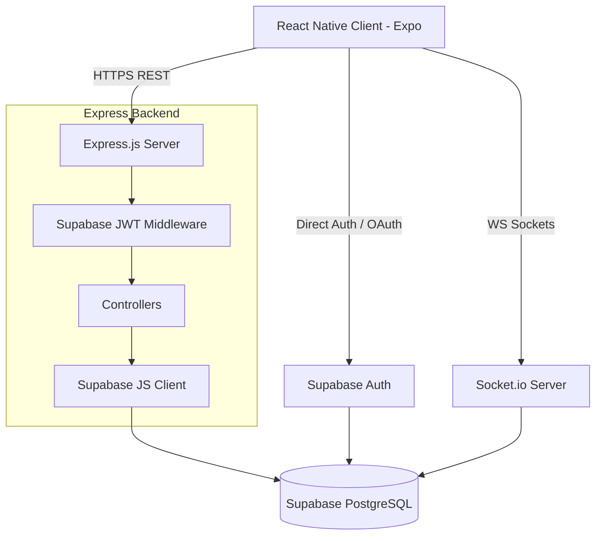

# Backend System Architecture & Implementation Plan: TripMate India (Supabase & Express Hybrid Stack)

This document outlines the architecture, database schema, and deployment plan for the TripMate India backend. The stack combines the rapid database/auth services of **Supabase** with the custom route flexibility of **Express.js**, authenticated via Google OAuth and JWT, and backed by **Socket.io** for real-time messaging.

---

## 1. System Architecture Overview

This hybrid architecture leverages Supabase as the core Database (PostgreSQL), Auth Provider (Google OAuth & OTP), and Blob Storage, while routing client actions through a custom Express.js server for business validations, third-party hooks, and Socket.io WebSocket connections.



---

## 2. Technical Stack Specifications

*   **REST Server:** Node.js with Express.js
*   **Database (PostgreSQL):** Supabase (Relational Database Service)
*   **ORM / Client Library:** `@supabase/supabase-js` (PostgreSQL Client SDK)
*   **Auth Services:** Supabase Auth (Email OTP & Google OAuth) + custom JWT/bcrypt verification for local credentials
*   **Real-time Layer:** Socket.io (managing custom room chats and typing states)
*   **Media Storage:** Supabase Storage Buckets (avatars, trip highlights)

---

## 3. Directory Layout (`/backend`)

The Express server acts as the controller and Socket host, linking directly to Supabase APIs:

```
backend/
├── config/
│   └── supabase.js           # Supabase client initialization (URL, Service Key)
├── controllers/
│   ├── authController.js     # Post-OAuth sync, profile setups
│   ├── tripController.js     # Trips query filters & creator endpoints
│   ├── platoonController.js  # Squad creation, joins, approval handlers
│   ├── dashboardController.js# Postgres aggregate query calculations
│   └── paymentController.js  # Stripe payment intents and webhooks processing
├── middleware/
│   ├── auth.js               # Validates Supabase session JWT tokens
│   ├── error.js              # Express error catcher
│   └── validate.js           # Body schema checking
├── routes/
│   ├── auth.js               # User sync routers
│   ├── trips.js              # Trips listing and creation routers
│   ├── platoons.js           # Platoon operations and requests
│   └── payments.js           # Stripe Payment Intent creation & webhook endpoints
├── utils/
│   ├── helpers.js            # General date formatting & converters
│   └── mailer.js             # Nodemailer email SMTP configuration & templates
├── server.js                 # Express initializer & Socket.io handlers
├── package.json              # Backend dependencies
└── .env                      # Environment configurations
```

---

## 4. Supabase Database Schema (PostgreSQL Tables)

Below are the SQL scripts to initialize the PostgreSQL schema in Supabase. These tables utilize foreign keys, arrays, and JSONB structures.

### 4.1 Users Table (`users`)
Stores user profiles and aligns with Supabase's native `auth.users` UUID.
```sql
CREATE TABLE public.users (
    id UUID PRIMARY KEY REFERENCES auth.users(id) ON DELETE CASCADE,
    name TEXT NOT NULL,
    email TEXT UNIQUE NOT NULL,
    phone TEXT UNIQUE,
    role TEXT CHECK (role IN ('traveler', 'provider', 'partner', 'admin')) DEFAULT 'traveler',
    avatar_url TEXT DEFAULT '',
    preferences TEXT[] DEFAULT '{}',
    is_verified BOOLEAN DEFAULT FALSE,
    created_at TIMESTAMP WITH TIME ZONE DEFAULT TIMEZONE('utc'::text, NOW()) NOT NULL
);
```

### 4.2 Trips Table (`trips`)
Holds group expeditions and trip itinerary structures (using Postgres `JSONB`).
```sql
CREATE TABLE public.trips (
    id UUID PRIMARY KEY DEFAULT gen_random_uuid(),
    title TEXT NOT NULL,
    location TEXT NOT NULL,
    price INT NOT NULL CHECK (price >= 0),
    duration TEXT NOT NULL, -- e.g. "9 Days"
    slots_total INT NOT NULL CHECK (slots_total >= 1),
    slots_left INT NOT NULL,
    category TEXT NOT NULL,
    image_url TEXT NOT NULL,
    is_featured BOOLEAN DEFAULT FALSE,
    itinerary JSONB NOT NULL DEFAULT '[]'::jsonb, -- Array of day itinerary objects
    provider_id UUID REFERENCES public.users(id) ON DELETE SET NULL,
    created_at TIMESTAMP WITH TIME ZONE DEFAULT TIMEZONE('utc'::text, NOW()) NOT NULL
);

-- Indexing for fast search queries
CREATE INDEX idx_trips_location_category ON public.trips(location, category);
```

### 4.3 Platoons Table (`platoons`)
Tracks active squad members and user join requests.
```sql
CREATE TABLE public.platoons (
    id UUID PRIMARY KEY DEFAULT gen_random_uuid(),
    trip_id UUID REFERENCES public.trips(id) ON DELETE CASCADE,
    leader_id UUID REFERENCES public.users(id) ON DELETE CASCADE,
    members UUID[] NOT NULL DEFAULT '{}',
    pending_requests UUID[] NOT NULL DEFAULT '{}',
    status TEXT CHECK (status IN ('planning', 'confirmed', 'active', 'completed')) DEFAULT 'planning',
    created_at TIMESTAMP WITH TIME ZONE DEFAULT TIMEZONE('utc'::text, NOW()) NOT NULL
);

CREATE INDEX idx_platoons_trip_id ON public.platoons(trip_id);
```

### 4.4 Messages Table (`messages`)
Logs platoon group discussions.
```sql
CREATE TABLE public.messages (
    id UUID PRIMARY KEY DEFAULT gen_random_uuid(),
    platoon_id UUID REFERENCES public.platoons(id) ON DELETE CASCADE,
    sender_id UUID REFERENCES public.users(id) ON DELETE SET NULL,
    text TEXT NOT NULL,
    created_at TIMESTAMP WITH TIME ZONE DEFAULT TIMEZONE('utc'::text, NOW()) NOT NULL
);

CREATE INDEX idx_messages_platoon_time ON public.messages(platoon_id, created_at DESC);
```

### 4.5 OTP Verification Table (`otps`)
Stores single-use transient authentication verification codes.
```sql
CREATE TABLE public.otps (
    id UUID PRIMARY KEY DEFAULT gen_random_uuid(),
    email TEXT NOT NULL,
    code TEXT NOT NULL,
    expires_at TIMESTAMP WITH TIME ZONE NOT NULL,
    created_at TIMESTAMP WITH TIME ZONE DEFAULT TIMEZONE('utc'::text, NOW()) NOT NULL
);

CREATE INDEX idx_otps_email_code ON public.otps(email, code);
```

---

## 5. Authentication & Sync Flow (Google OAuth)

1.  **Mobile Client Auth:** The client triggers Google OAuth via Supabase Client (`auth.signInWithOAuth`).
2.  **Redirect & Session:** Supabase Auth processes the login and returns a Session Token (`JWT`) containing the user's UUID.
3.  **Express Synchronization (`POST /api/v1/auth/sync`):** The client sends this token to Express. Express verifies the token using the Supabase JWT secret and verifies if a profile exists in the `public.users` table. If not, it creates a new database entry using details (name, email, avatar) extracted from the JWT payload.

```
[Mobile Client]             [Supabase Auth]              [Express API]            [Postgres DB]
       |                           |                           |                        |
       |--- 1. Google Login ------>|                           |                        |
       |<-- 2. JWT Session --------|                           |                        |
       |                                                       |                        |
       |--- 3. Sync User Profile (POST /auth/sync) ----------->|                        |
       |                                                       |--- 4. Check Profile -->|
       |                                                       |<-- 5. No profile ------|
       |                                                       |--- 6. Insert User ---->|
       |<-- 7. Sync Complete (200 OK) -------------------------|                        |
```

---

## 6. Socket.io Live Messaging

WebSocket channels align with the Express server port.

*   **Socket Connection:** Client initiates `socket.io-client` connection. Express middleware checks the `Authorization` header containing the Supabase Auth JWT.
*   **Active Chat Rooms:**
    *   `join_platoon`: Client joins the room matching the platoon UUID.
    *   `send_message`: Client sends text. The Express server writes the message directly to Supabase (`public.messages`) using the Node SDK, and broadcasts the created message back to the room.

---

## 7. Storage Bucket Strategy
Create a bucket in Supabase named `tripmate-assets` configured for Public access.
*   **`avatars/` path:** Stores user profile pictures.
*   **`trips/` path:** Stores trip itineraries photos.
*   **Express helper:** Express will generate Signed URLs (`supabase.storage.from().createSignedUrl()`) for write updates, allowing clients to upload assets securely directly from mobile devices.

---

## 8. Stripe Payment Integration Architecture
Paid curated trips process transactions via Stripe using the Express backend and mobile client:
*   **Dependencies:** `stripe` NPM package on backend, `@stripe/stripe-react-native` on client.
*   **Endpoints:**
    1.  `POST /api/v1/payments/create-intent`
        *   *Payload:* `{ "tripId": "TRIP_UUID", "platoonId": "PLATOON_UUID" }` (JWT authorization required).
        *   *Handler:* Fetches trip price from `public.trips`. Calls `stripe.paymentIntents.create({ amount: price * 100, currency: 'inr', metadata: { platoonId, userId } })`.
        *   *Returns:* `{ "clientSecret": "pi_...", "ephemeralKey": "ek_...", "customerId": "cus_..." }` required by the mobile Payment Sheet.
    2.  `POST /api/v1/payments/webhook`
        *   *Handler:* Consumes raw payload to verify signatures via `stripe.webhooks.constructEvent(req.body, sig, endpointSecret)`.
        *   *Event Listening:* Extracts `platoonId` and `userId` from `payment_intent.succeeded` metadata, then runs an array append (`array_append`) query on the `members` column in the `public.platoons` table in Supabase.

---

## 9. Future Integration Roadmap
*   **AMP Service & API Adaptations:**
    *   **Map Services (Google Maps / Mapbox):** Expose routing APIs to retrieve geographical coordinates for predefined trip itineraries and active platoon vehicle routes.
    *   **Amplitude Analytics (AMP):** Integrate custom Express middleware to log analytics events on successful user syncs, custom platoon launches, and transaction details directly to Amplitude's servers.

