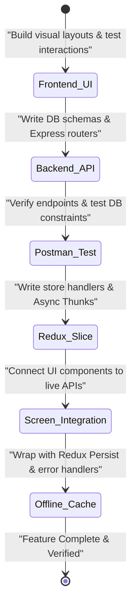

# Solo Developer Weekly Sprint Plan: TripMate India (12-Week Roadmap)

As a solo developer building both the **Frontend Mobile Client (Expo/React Native)** and **Backend Service (Express/Node.js/Supabase)**, this plan is structured **feature-by-feature** and **week-by-week**. 

Instead of building all frontends and then all backends, you will build the UI, database/endpoints, and API integration for each feature sequentially. This minimizes context switching and guarantees you have a fully testable slice of the app running at the end of each feature block.

---

## 📅 High-Level Weekly Feature Schedule

```mermaid
gantt
    title Solo Developer Weekly Feature Roadmap
    dateFormat  W
    axisFormat  W%W
    
    section Onboarding & Auth
    W1: UI Onboarding & Forms           :active, w1, 1, 1w
    W2: Supabase Setup & Google OAuth   :w2, after w1, 1w
    W3: Auth Sync Integration (Redux)   :w3, after w2, 1w
    
    section Trips Discovery
    W4: Discovery UI (Cards/Filters)    :w4, after w3, 1w
    W5: Trips DB (Supabase Postgres)    :w5, after w4, 1w
    W6: Trips Integration (Redux Fetch) :w6, after w5, 1w
    
    section Platoons Grouping
    W7: Platoons UI (Details/Forms)     :w7, after w6, 1w
    W8: Platoons DB (Postgres FK Logic) :w8, after w7, 1w
    W9: Platoons Integration (Joins/Redux):w9, after w8, 1w
    
    section Analytics & Chat
    W10: Dashboard Charts & Metrics UI  :w10, after w9, 1w
    W11: Metrics Aggregation Backend    :w11, after w10, 1w
    W12: WebSockets Chat & App Release  :w12, after w11, 1w
```

---

## 📋 Week-by-Week Action Plan

---

### 🛡️ Feature Block 1: Onboarding & User Authentication (Weeks 1 - 3)

#### 📅 Week 1: Frontend Auth UI Layouts
*   **Goal:** Build the interactive, visual entry shell of the app.
*   **Frontend Mobile Tasks:**
    *   Review the global theme provider [utils/theme.tsx](file:///d:/tripmate/utils/theme.tsx) to ensure color palette tokens match your design specs.
    *   Build swipable carousels inside [app/(auth)/onboarding.tsx](file:///d:/tripmate/app/(auth)/onboarding.tsx) with a light/dark mode switch widget.
    *   Develop form views: Login ([login.tsx](file:///d:/tripmate/app/(auth)/login.tsx)) and Sign-Up ([register.tsx](file:///d:/tripmate/app/(auth)/register.tsx)).
    *   Implement input fields utilizing the reusable [FormInput.tsx](file:///d:/tripmate/components/FormInput.tsx) styling wrappers.
    *   Include a prominent Google OAuth sign-in button on Login and Registration screens.
*   **Weekly Deliverable:** Fully navigable Auth UI flow running on simulated devices, responding to dark mode changes.

#### 📅 Week 2: Supabase Setup, Google OAuth & Mailing Server Configuration
*   **Goal:** Configure the cloud Supabase project, establish the backend server, set up SMTP credentials, and create Express endpoints.
*   **Backend Server Tasks:**
    *   Initialize the `/backend` codebase: `npm init -y`, install `express`, `@supabase/supabase-js`, `cors`, `dotenv`, and `nodemailer`.
    *   Set up a Supabase Project in the Supabase Dashboard, note down project URL, Anon Key, and Service Role Key.
    *   Create Google Cloud Credentials (OAuth Client ID) and configure redirects in Supabase.
    *   Setup SMTP mail credentials (host, port, user, pass) inside `.env` configuration file.
    *   Execute SQL schema definitions inside the Supabase SQL editor to create public `users` and `otps` tables.
    *   Write Express sync endpoint (`POST /api/v1/auth/sync`) and the email sender utility (`utils/mailer.js`).
*   **Weekly Deliverable:** Ready Supabase cloud database with Google OAuth parameters, Express SMTP mail integration, and active database tables.

#### 📅 Week 3: Auth Integration (Google Sign-In & Email OTP Flow)
*   **Goal:** Bridge frontend and backend, enabling session persistence on the mobile client for both Google Auth and Email OTP.
*   **Dual Integration Tasks:**
    *   **Frontend:** Integrate Google Sign-in redirect flows on mobile client. Set up email/OTP verification input views.
    *   **Frontend:** Write `authSlice.ts` to manage session tokens, email caches, and trigger backend verification requests.
    *   **Backend:** Write `POST /api/v1/auth/otp/request` (generates random PIN, saves to DB `otps`, sends HTML email) and `verify` endpoints.
    *   **Integration:** Store session JWTs in device storage via client-side storage. Test the complete email OTP verification cycle.
*   **Weekly Deliverable:** Functional Google Sign-In and Email OTP authentication workflows. Profiles are verified and created inside database automatically.

---

### 🗺️ Feature Block 2: Trips & Journeys Discovery (Weeks 4 - 6)

#### 📅 Week 4: Discovery UI (Featured Sliders & Feeds)
*   **Goal:** Develop search features, visual banners, and list feeds on the client.
*   **Frontend Mobile Tasks:**
    *   Structure the tab layout shell in [app/(tabs)/_layout.tsx](file:///d:/tripmate/app/(tabs)/_layout.tsx).
    *   Complete the animated bottom tab component ([BottomNavBar.tsx](file:///d:/tripmate/components/BottomNavBar.tsx)) driven by `Moti` spring transitions.
    *   Design the discovery hub in [app/(tabs)/home.tsx](file:///d:/tripmate/app/(tabs)/home.tsx) with a curved header container ([OrganicHeader.tsx](file:///d:/tripmate/components/OrganicHeader.tsx)).
    *   Build cards: horizontal slider cards for featured expeditions ([FeaturedTripCard.tsx](file:///d:/tripmate/components/FeaturedTripCard.tsx)) and vertical scrolling lists ([TripCard.tsx](file:///d:/tripmate/components/TripCard.tsx)).
*   **Weekly Deliverable:** Static discovery interface scrolling at 60 FPS using `@shopify/flash-list` mock configurations.

#### 📅 Week 5: Trips SQL Tables & Retrieval Endpoints
*   **Goal:** Create Postgres tables in Supabase and write query routes in Express.
*   **Backend Server Tasks:**
    *   Create the public `trips` table in Supabase PostgreSQL with constraints (price, categories, and foreign keys references public `users`).
    *   Insert seed rows for destinations (Ladakh, Goa, Kerala) using Supabase SQL editor.
    *   Develop Express router `GET /api/v1/trips` reading from public `trips` with `.select()`, `.ilike()` filters, and category sorting.
    *   Write `POST /api/v1/trips` for verified trip guides/providers to insert new rows.
*   **Weekly Deliverable:** API returning real Postgres rows matching category search filters.

#### 📅 Week 6: Trips API Redux Integration & Live Feed Sync
*   **Goal:** Wire the React Native Discovery feeds to fetch live records from PostgreSQL.
*   **Dual Integration Tasks:**
    *   **Frontend:** Create `tripSlice.ts` to coordinate search queries, filter states, and loaded results.
    *   **Frontend:** Call the backend GET router inside `home.tsx` through Redux async actions.
    *   **Integration:** Bind search input states directly to the Redux state, triggering debounce queries on the database.
    *   **Integration:** Implement Pull-to-Refresh handlers to reload listings from the server.
*   **Weekly Deliverable:** Fully dynamic discovery page filtering and pulling active trip packages directly from the database based on search terms.

---

### 🛡️ Feature Block 3: Platoon (Travel Squads) System (Weeks 7 - 9)

#### 📅 Week 7: Platoons Layouts & Request Forms UI
*   **Goal:** Design UI layouts for travel group details and squad lists.
*   **Frontend Mobile Tasks:**
    *   Build [app/(tabs)/platoons.tsx](file:///d:/tripmate/app/(tabs)/platoons.tsx) showing tabs for "My Platoons" and "Invitations".
    *   Design a detailed squad page detailing group leaders, active members, remaining slots, and pending requests.
    *   Develop forms to input custom trip itineraries and create unplanned Platoons.
*   **Weekly Deliverable:** Visual screens for travel groups, participant counts, and creation dialog sheets.

#### 📅 Week 8: Platoons Postgres Tables & Request Logic
*   **Goal:** Configure relationships and join approval APIs on the backend.
*   **Backend Server Tasks:**
    *   Create the public `platoons` table with array references for member UUIDs and pending request UUIDs.
    *   Implement Express route to launch custom platoons (`POST /api/v1/platoons`).
    *   Write the join request router: `POST /api/v1/platoons/:id/join` using Supabase SDK query updates.
    *   Implement leader approval validation logic (`PATCH /api/v1/platoons/:id/approve`).
*   **Weekly Deliverable:** Active database backend managing platoon squads with UUID array mutations and constraints.

#### 📅 Week 9: Platoons State Management & Stripe Payment Integration
*   **Goal:** Connect travel squad pages on mobile to backend actions, enabling user join workflows and Stripe payment processing for curated trips.
*   **Dual Integration Tasks:**
    *   **Frontend:** Create `platoonSlice.ts` managing platoon state, members, and approval requests. Install `@stripe/stripe-react-native` and wrap the app in the Stripe Provider component.
    *   **Frontend:** Integrate the Stripe Native Payment Sheet trigger on the Curated Trip details page, requesting the client secret from the backend.
    *   **Backend:** Install `stripe` SDK on Express. Implement `/api/v1/payments/create-intent` to generate Payment Intents and ephemeral keys.
    *   **Backend:** Write `POST /api/v1/payments/webhook` raw body receiver, validating signatures and updating user participation arrays in the database.
    *   **Integration:** Implement the platoon leader view on mobile to accept or reject members. Test the full payment-to-join cycle.
*   **Weekly Deliverable:** End-to-end squad workflow: travelers request to join custom platoons (requires approval) or pay via Stripe for curated platoons (automatic slot assignment on success).

---

### 📊 Feature Block 4: Dashboard, Analytics & Live Chat (Weeks 10 - 12)

#### 📅 Week 10: Dashboard Analytics & Metric Visualizations
*   **Goal:** Complete the traveler dashboard, integrating custom metric configurations and charts.
*   **Frontend Mobile Tasks:**
    *   Assemble the grid layout in [app/(tabs)/dashboard.tsx](file:///d:/tripmate/app/(tabs)/dashboard.tsx) using modular card wrappers ([MetricCard.tsx](file:///d:/tripmate/components/MetricCard.tsx)).
    *   Build out visual metrics for savings and completed trip logs.
    *   Implement SVG analytics graphs in [AnalyticsChartCard.tsx](file:///d:/tripmate/components/AnalyticsChartCard.tsx) using dynamic inputs.
*   **Weekly Deliverable:** Polished client dashboard rendering metrics and charts using local React component configurations.

#### 📅 Week 11: Backend Aggregation & Offline Synchronization
*   **Goal:** Write backend data calculators and enable offline caching.
*   **Dual Integration Tasks:**
    *   **Backend:** Write Postgres aggregation queries in Express (`GET /api/v1/users/dashboard`) calculating total trips taken, active platoons, and estimated savings.
    *   **Frontend:** Setup `redux-persist` + `AsyncStorage` to cache dashboard stats and trips locally on the phone.
    *   **Integration:** Bind metric cards to query values from the backend, failing gracefully to offline-cached values if network is down.
*   **Weekly Deliverable:** Fully dynamic user dashboard updating numbers from database calculations, with complete offline resilience.

#### 📅 Week 12: Real-Time Chat (Socket.io) & Release Validation
*   **Goal:** Implement real-time group chat inside platoons and build release packages.
*   **Dual Integration Tasks:**
    *   **Backend:** Incorporate `socket.io` inside `server.js` matching active platoon UUIDs with socket rooms.
    *   **Frontend:** Add `socket.io-client` on React Native. Create a chat feed layout inside the platoon details page.
    *   **Integration:** Wire up event triggers for sending messages, typing states, and receiving instant updates.
    *   **Release QA:** Run compiler check scripts (`npm run tsc`) and test across Android & iOS simulators. Compile Android `.apk`/`.aab` formats.
*   **Weekly Deliverable:** Completed production mobile application with live group chats, database services, and build files ready to share.

---

## 🧭 Feature-to-Feature Development Lifecycle

When working alone, follow this lifecycle for **every single feature block**:



---

## 🔮 Post-12-Week Roadmap: Advanced Integrations
Following the initial release, transition to the next development cycle for advanced services:
*   **Google Maps / Mapbox Integration:** Build frontend map containers to render geographic trails, pinned accommodation hubs, and real-time transit locations. Expose backend routing coordinators.
*   **Amplitude Analytics (AMP):** Integrate tracking SDKs on mobile client screens and custom Express log middlewares to monitor signup conversions and user engagement.

